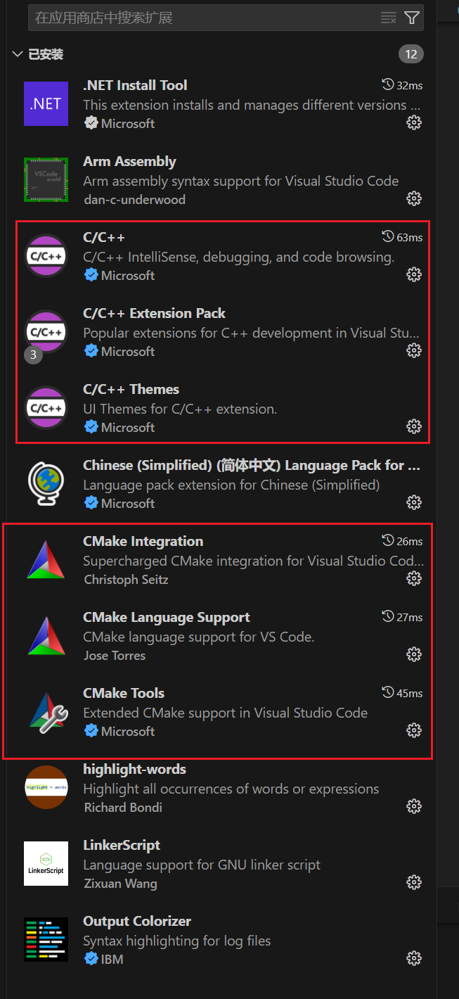
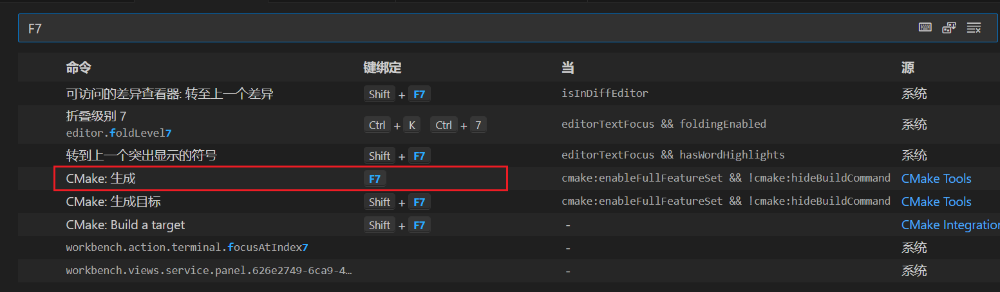
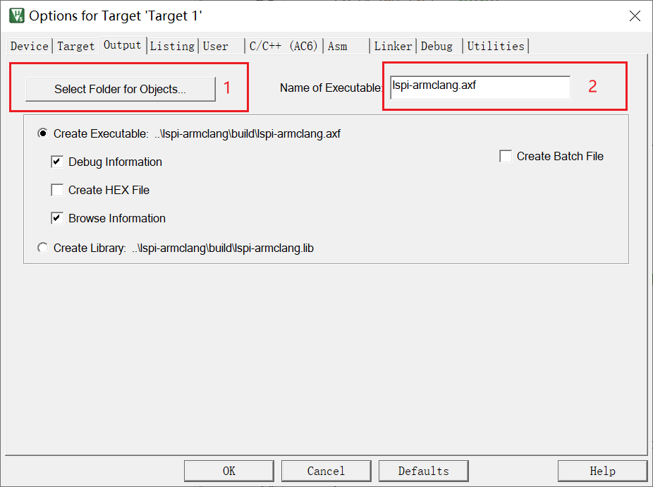
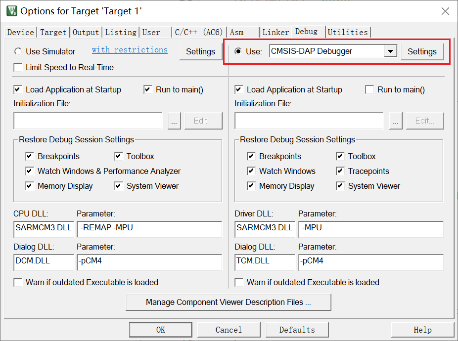
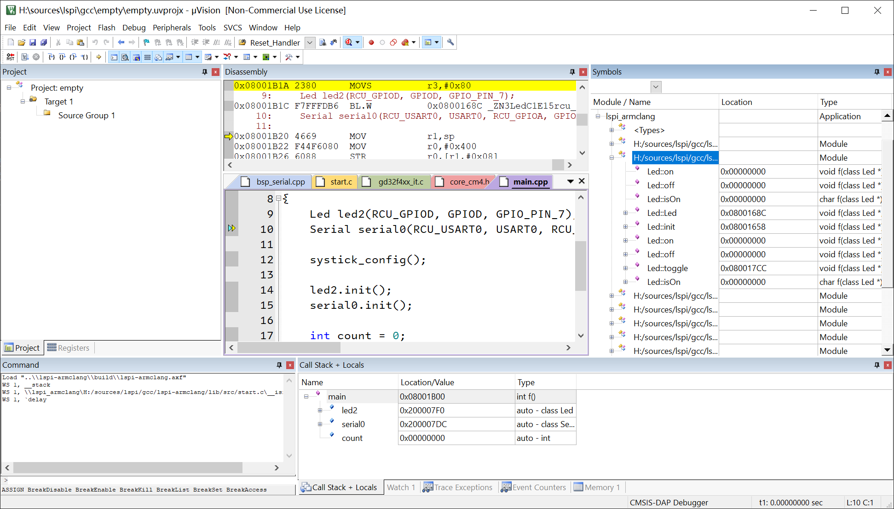

# 使用VSCode + CMake + Keil开发梁山派

> 关键字：梁山派，GD32F470, VSCode, CMake

为什么要有这个项目，因为Keil编写代码的功能实在是太烂了，反正我不喜欢[哭笑]。

## 一、环境配置

### 1. 软件安装

#### 1. 安装Keil

这个在网上随便搜个教程就可以，记住安装位置，将`<安装路径>\Keil_v5\ARM\BIN`加入到`PATH`环境变量里面。如何加环境变量？百度就行了。

#### 2. VSCode配置

##### 1. 扩展安装

红色框中的扩展是必装的，其他的选装，建议都装上，其中`.NET Install Tool`是`CMake Language Support`的依赖项，装这个的时候会自动装，这个插件可能要科学上网。




##### 2. VSCode用户配置

在VSCode中执行快捷键`Ctrl+Shift+P`，接着输入`Open User Settings Json`，选择第一个回车，在其中增加这个配置：

```json
{
    /* 配置IntelliSenseEngine使用Tag Parser的方式自动补全 */
    "C_Cpp.intelliSenseEngine": "Tag Parser",
    /* 开启cmake状态栏快捷按钮 */
    "cmake.options.statusBarVisibility": "visible",
    /* 配置cmake配置环境变量，将Keil编译器加入到PATH环境变量（也可以直接修改电脑环境变量 */
    "cmake.configureEnvironment": {
        "PATH": "$penv{PATH};D:\\Install\\Keil_v5\\ARM\\ARMCLANG\\bin"
    },
    /* 配置cmake编译环境变量，将Keil编译器加入到PATH环境变量（也可以直接修改电脑环境变量 */
    "cmake.buildEnvironment": {
        "PATH": "$penv{PATH};D:\\Install\\Keil_v5\\ARM\\ARMCLANG\\bin"
    }
}
```

##### 3. 快捷键设置（自行决定）

我一般喜欢将`F7`设置为编译当前目标。



## 二、编译工程

使用VSCode打开工程根目录，第一次编译按如下顺序执行，以后直接按`F7`就可以增量编译了。
1. 按下组合键`Ctrl+Shift+P`，输入`CMake Configure`按下回车。
2. 等待执行完成，按下`F7`开始编译，或者继续按下组合键`Ctrl+Shift+P`，输入`CMake Build`按下回车。

一切完成之后将在`build`目录下看到编译好的`lspi-armclang.axf`。

## 三、烧录/调试工程

因为梁山派采用的是`CMSIS-DAP`调试器，我又懒得配置`OpenOCD`，所以我调试和下载程序就继续用`Keil`了。

1. 用Keil创建一个`GD32F470ZG`的空白工程。
2. 在工程属性中设置`Output`为我们这个工程的`build`目录，设置`Name of Executable`为我们编译出来的`axf`文件。

3. 在工程属性中设置`Debug`中配置调试选项，这个和直接使用Keil开发项目没有区别。

4. 完成上面3步之后就可以直接在Keil中按下`F8`将我们编译的`lspi-armclang.axf`烧录到梁山派中。
5. 工程调试，这个没什么说的，和直接使用Keil开发项目一致。

> 以上步骤主要是第2步需要特别注意，其他的都和直接使用Keil开发项目一致。

附上一张调试截图：

